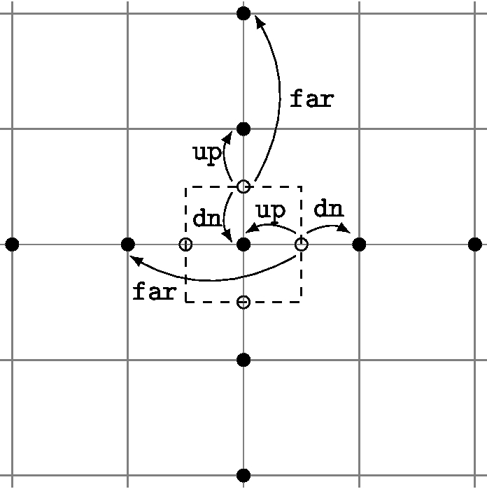
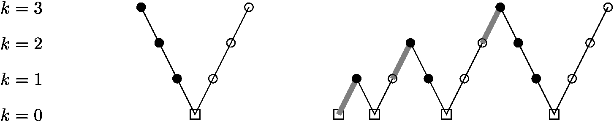
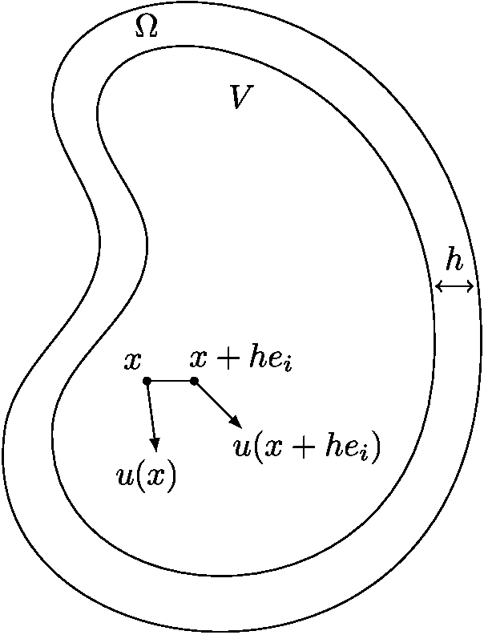
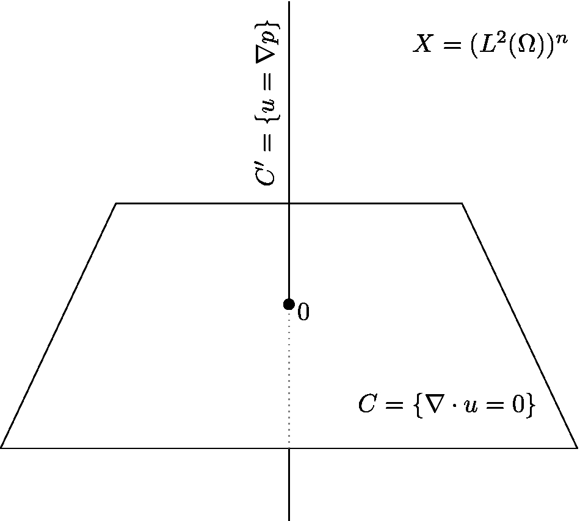
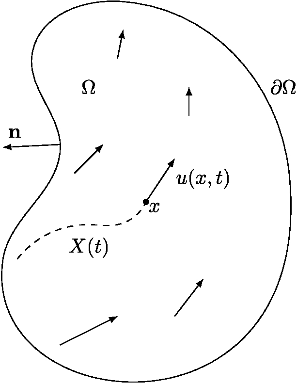
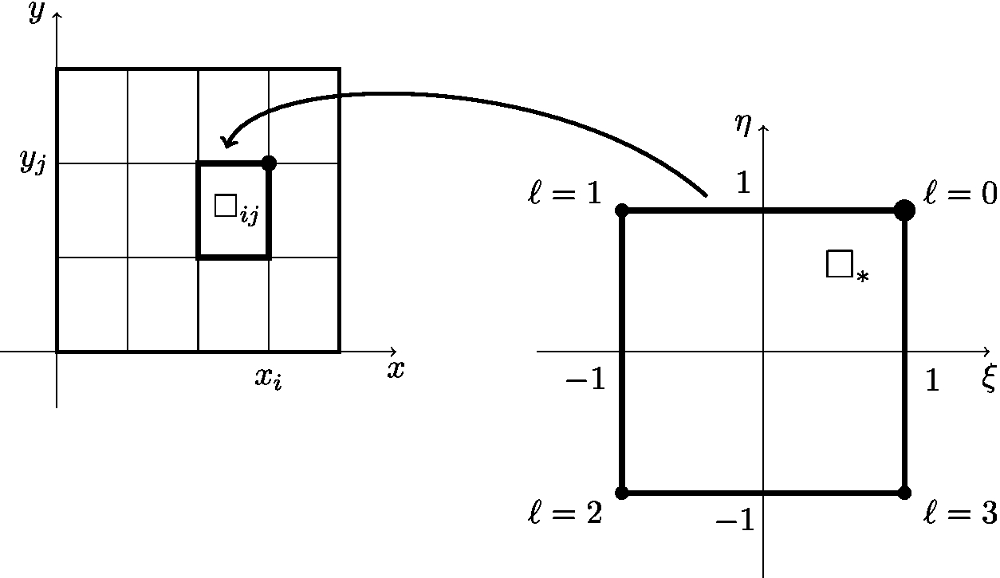
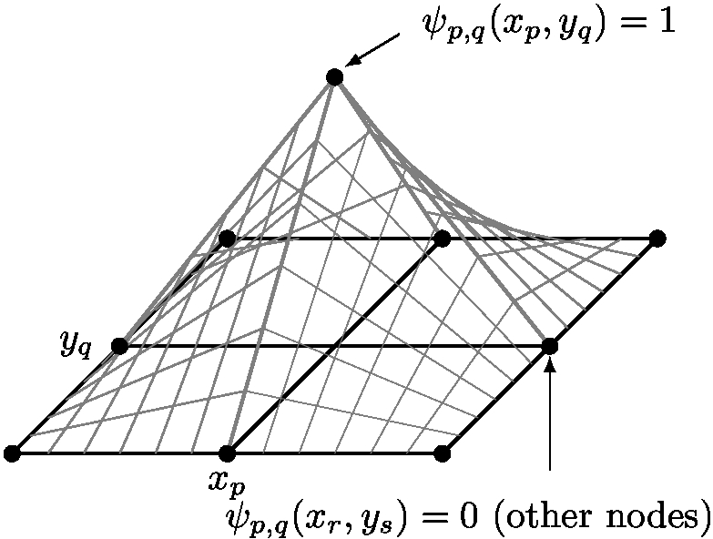
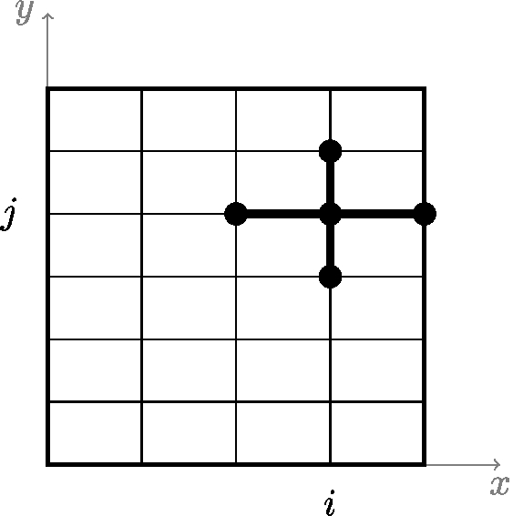

# tikz-examples

This is a grab bag of LaTeX [TikZ](https://texample.net/tikz/) examples which I have created for various reasons, for possible future use.

Each example `.tex` here uses the `standalone` LaTeX class to create the image.  If you want to use the figure in your document then cut-and-paste the `tikzfigure` environment from the example `.tex` here.  Also note which packages are needed; `\usepackage{tikz}` is required in all cases, but an extra library may be needed.  See the preamble of the example.

* [`advectlimiter.tex`](advectlimiter.tex):

   </a>

* [`cycles.tex`](cycles.tex):

   </a>

* [`difference-quotients.tex`](difference-quotients.tex):

   </a>

* [`div-free-orthogonal.tex`](div-free-orthogonal.tex):

   </a>

* [`fluid-domain.tex`](fluid-domain.tex):

   </a>

* [`q1gridandref.tex`](q1gridandref.tex):

   </a>

* [`q1hat.tex`](q1hat.tex):

   </a>

* [`unitsquaregridstencil.tex`](unitsquaregridstencil.tex):

   </a>

## generating the image files for inclusion above

<i>These instructions are about making the current `README.md` at [github.com/bueler/tikz-examples](https://github.com/bueler/tikz-examples) look right.  Ignore it if you are grabbing examples from the above.</i>

Run `pdflatex` on each `.tex` you care about.  Then do

    $ make cropfigures

Then use `convert` from ImageMagick:

    $ convert -density 300 -quality 100 file.pdf results/file.jpg

For this to work, one may need to `/etc/ImageMagick-6/policy.xml` to comment-out a line which looks like

    <policy domain="coder" rights="none" pattern="PDF" />
