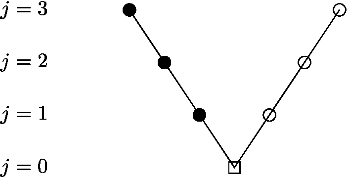

# tikz-examples

## just a grab bag!

This repo contains a grab bag of LaTeX [TikZ](https://texample.net/tikz/) examples which I have created for various reasons and might want to work from.  Each `.tex` uses the `standalone` LaTeX class to just get the image, but cut-and-paste from the `.tex` will easily put the example in your document.

* [`difference-quotients.tex`](difference-quotients.tex):

   </a>

* [`div-free-orthogonal.tex`](div-free-orthogonal.tex):

   </a>

* [`fluid-domain.tex`](fluid-domain.tex):

   </a>

* [`v-cycle.tex`](v-cycle.tex):

   </a>

## generating the image files for inclusion above

<i>These instructions are about making the current `README.md` at [github.com/bueler/tikz-examples](https://github.com/bueler/tikz-examples) look right.  Ignore it if you are grabbing examples from the above.</i>

Run `pdflatex` on each `.tex` you care about.  Then do

    $ make cropfigures

Then use `convert` from ImageMagick:

    $ convert -density 300 -quality 100 file.pdf results/file.jpg

For this to work, one may need to `/etc/ImageMagick-6/policy.xml` to comment-out a line which looks like

    <policy domain="coder" rights="none" pattern="PDF" />